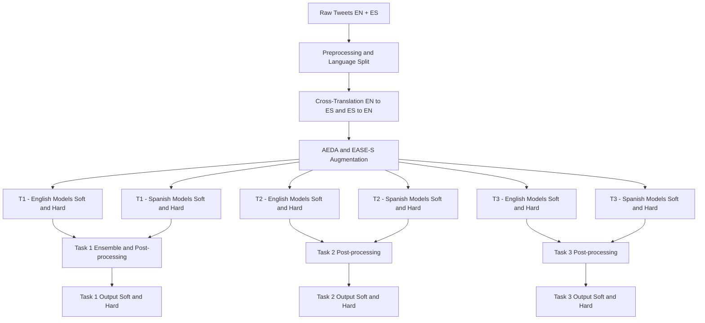

# Multilingual Sexism Detection in Tweets

## Overview

This project presents a comprehensive multilingual NLP framework for the detection and categorization of **sexism in tweets**, developed for the CLEF EXIST 2025 Lab. The solution tackles three related tasks in **both English and Spanish**, using **ensemble learning**, **data augmentation**, and **cross-lingual training strategies**.

We built and fine-tuned **12 independent models**, optimized for hard and soft probability predictions across tasks and languages. Key innovations include dynamic ensembling, translation-based augmentation, and post-processing techniques that simulate real-world annotation behavior.

---

## Tasks

### Task 1: Sexism Identification (Binary Classification)
- **Output**: "YES" or "NO"
- **Approach**: Ensemble-based classification using soft and hard thresholds derived from annotator votes.

### Task 2: Source Intention Classification (Multi-class)
- **Classes**: NO, DIRECT, REPORTED, JUDGMENTAL
- **Approach**: Metadata-aware modeling using annotator demographic splits, class balancing with AEDA Augmentation, and separate pipelines for hard and soft labels.

### Task 3: Sexism Categorization (Multi-label)
- **Categories**: Multiple sexism categories per tweet: Ideological and inequality, Stereotyping and dominance, Objectification, Sexual violence, Misogyny and non-sexual violence
- **Approach**: EASE-S and AEDA Augmentation and snapped soft probabilities to reflect multi-label annotation using a 1/6 threshold for annotator agreement.

---
## Data Augmentation

To improve generalization and data diversity, we applied three main augmentation strategies:

### 1. Cross‑Translation
- Each tweet was translated into the opposite language using the **Helsinki‑NLP** translation model — English tweets were translated to Spanish and added to the Spanish dataset, and vice versa.  
- **Cross‑translation** creates mirrored datasets across languages while preserving labels and structure, effectively doubling the dataset size and enabling language‑aware training.

### 2. EASE (Extract Units, Acquire Labels, Sift, Employ)
1. **Extract** meaningful sentence‑level units via NLTK  
2. **Acquire labels** for these units using pre‑trained models  
3. **Sift** out samples based on length and relevance  
4. **Employ** synonym replacement  
5. **Merge** the augmented data back into the original training set

### 3. AEDA (An Easy Data Augmentation)
- Random punctuation insertion in tweets  
- Inspired by NYCU’s 2024 winning strategy  
- Applied to both original and cross‑translated datasets

---
## Architecture

